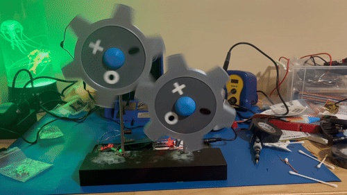
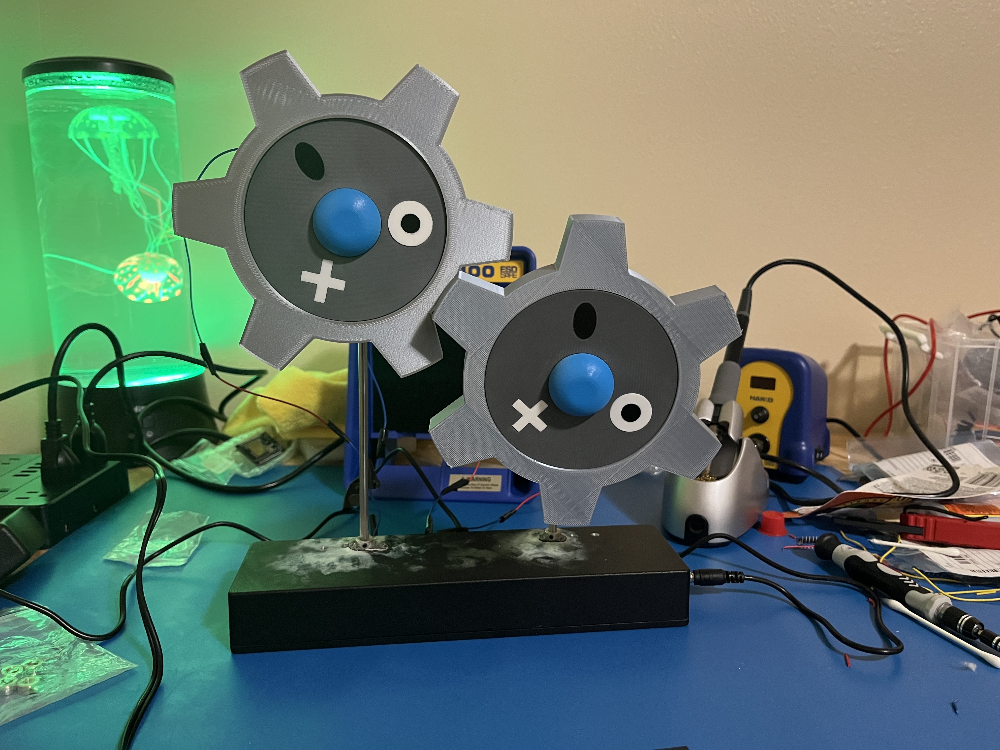
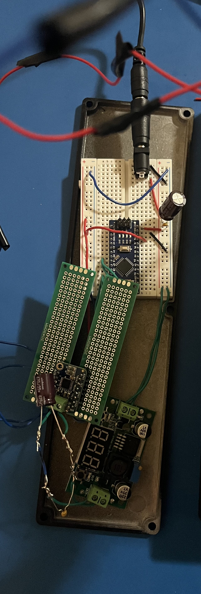
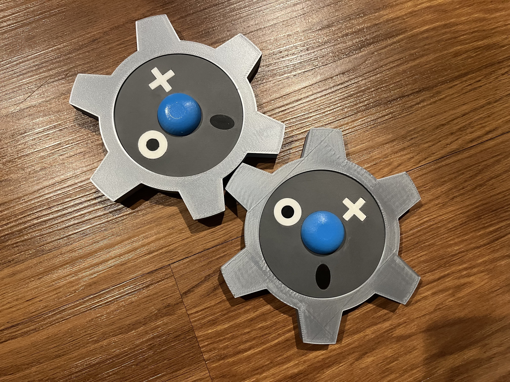
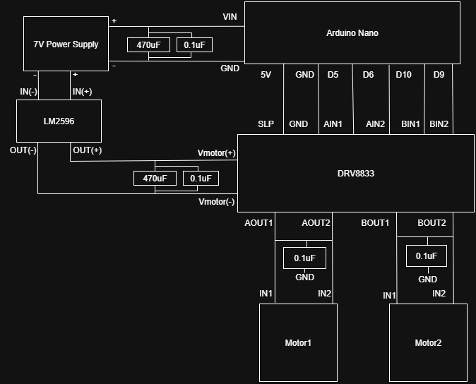

# Pokemon Model Klink

## Overview
- A model model of the Pokemon Klink, a Pokemon resembling two perpetually moving gears
- Working prototype with mild debugging remaining

## Features (Current vs Planned)
- Current: Functional rotating Klink gears prototype
- Planned: Synchronize gear speeds

## Repository Structure
- `docs/` → BOM, Notes 
- `firmware/` → Arduino Nano firmware
- `hardware/` → Wiring Diagrams
- `images/` → Photos

## Bill of Materials
See [BOM.md](docs/BOM.md)

## Demo
  
*Short demo of Klink prototype in action.*

## Photos

*Assembled Klink model on base.* 

*Internal wiring: Arduino Nano, DRV8833 motor driver, buck converter, and capacitors.*  

*3D-printed Klink body, front view.*

Additional photos can be found in [images/](images/).

## Wiring Diagrams

*Wiring connecting Arduino Nano, buck converter, motor controller, and motors,.*

## Current Status 
- Prototype works: both gears rotate continuously
- Gears are offset slightly and do not mesh; speeds are not yet synchronized
- Needs further debugging to achieve smoother motion

## Future Improvements
- Debug motor synchronization and correct speed mismatch
- Explore additional features:
  - Audio playback (Klink's in-game 'cry')
  - Adjustable rotation speed
